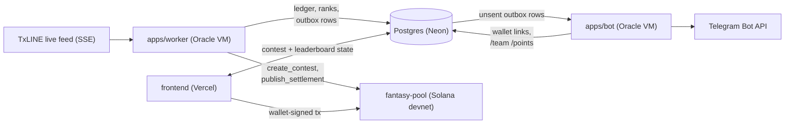

  

<h1 align="center">Daze</h1>

  Mobile-first Solana fantasy football for TxLINE-covered World Cup fixtures.

Daze is a fantasy contest app built around [TxLINE](https://txodds.com)-covered World Cup fixtures. The web app owns the entire experience — wallet auth, XI selection, team lock, live scoring, leaderboard, reconciliation, settlement, and prize claim — settled on Solana. A Telegram bot is an optional companion for reminders and personal point-change DMs; it never touches wallets, stakes, or team edits.

> [!IMPORTANT]
> This is a pre-release build. See [Release status](#release-status) before treating any contest as live.

## Features

- **Wallet-native entry** — Solana wallet auth, no separate account system.
- **Real lineups only** — player selection is sourced from live TxLINE lineup data; there is no hardcoded or scraped roster fallback.
- **Manual build or Quick Pick** — build an XI by hand or use a deterministic, seeded auto-pick.
- **Captain/vice-captain multipliers** — captain doubles every positive and negative delta, including reversals.
- **Append-only scoring ledger** — every point is reproducible from immutable raw provider payloads plus a versioned scoring ruleset; corrected provider events reverse and replace prior ledger entries rather than mutating history.
- **On-chain settlement** — an Anchor program holds entry stakes in a vault and pays out via Merkle-proof claims, not an operator wallet.
- **Automated contest lifecycle** — contests are opened per fixture and settled on-chain by a worker daemon, no manual operator step in the loop.
- **Telegram companion** — `/start`, `/link`, `/today`, `/team`, `/points`, `/settings`, `/unlink`, `/stop` for reminders and personal point/rank/correction/final-result DMs.

## Architecture

Daze is split into independently deployable services that never talk to each other directly — they coordinate only through committed state in Postgres and on-chain accounts. Nothing is a source of truth except a durable write.

Postgres (Neon) is the only thing connecting the frontend, worker, and bot — there is no direct network path between the three services. `apps/worker` and `apps/bot` run as two independent Docker containers on the same VM, each deployed by its own GitHub Actions workflow on push to `main`.

### Real-time scoring pipeline (`apps/worker`)

The worker holds a persistent SSE connection to TxLINE and turns every match action into a scored, notified, replay-safe fact within seconds:

1. **Ingest** — each SSE message is deduped by content hash and persisted as an immutable raw payload before anything else happens. No raw payload, no score.
2. **Normalize** — raw provider JSON is parsed into a versioned domain event (`packages/txline-client`); unknown position/action mappings fail closed rather than guessing.
3. **Project** — a pure, deterministic reducer (`packages/scoring`) turns normalized events into an append-only ledger of point deltas per entry. Corrections don't mutate history: an amended event reverses the prior ledger row and appends a new one, so the full ledger is always replayable from raw payloads alone.
4. **Persist & rank** — new ledger rows are written, entry totals recomputed, and ranks reassigned inside the same step.
5. **Notify** — a row is appended to `notification_outbox` in the same logical step as the ledger write, never inside the same DB transaction as a Telegram send. A separate 5-second poller (`apps/bot`'s companion loop inside the worker) drains unsent rows and calls the Telegram API. Idempotency keys derived from `(wallet, eventKey, revision)` make retries and worker restarts safe — a duplicate SSE delivery can never double-send a DM. See [ADR 0009](docs/decisions/0009-telegram-notification-policy.md).

The same worker process also runs the **contest lifecycle automation**: a poller opens a devnet contest for every upcoming fixture with no contest yet (`create_contest`), and once TxLINE reports the match finalized and the ledger is fully reconciled, another poller computes the top-3 payout split and publishes the settlement Merkle root on-chain (`publish_settlement`) — no operator step in between. See [ADR 0013](docs/decisions/0013-automated-contest-lifecycle.md).

### On-chain program (`programs/fantasy-pool`)

An Anchor program is the only custodian of staked funds:

| Instruction | Purpose |
| --- | --- |
| `create_contest` | Opens a contest vault for a fixture + stake tier, PDA-derived so the address is deterministic |
| `enter_contest` | Locks an entry's stake into the vault against a committed team hash |
| `publish_settlement` | Posts a Merkle root of final payouts once the worker reconciles the fixture |
| `claim_prize` | Pays a winner against a Merkle proof — no operator wallet ever moves funds |
| `cancel_contest` / `claim_refund` | Unwinds a contest that never met minimum entrants |

### Notification design

`notification_preferences` exposes five independent opt-in toggles (`point_impacts`, `rank_changes`, `reconciliation`, `final_results`, plus a global `paused`/`/stop`), each backed by its own producer in the worker so a user can, for example, mute play-by-play DMs but keep final-result alerts. The bot process (`apps/bot`) only ever reads state and sends outbound DMs or handles `/link`, `/team`, `/points`, `/settings`-style commands — it never writes to the outbox itself, keeping exactly one writer of `sent_at` and ruling out double-sends.

### Deployment topology

- **Frontend** — Next.js app on Vercel; owns wallet auth, the team builder, live scoring UI, leaderboard, and the claim flow.
- **Worker + bot** — two Docker containers on a single VM, each with its own env file and lifecycle; a container restart never affects the other.
- **Solana devnet** — the `fantasy-pool` program is the only place funds move; every service that touches it builds its own transactions client-side against the same account layout (`packages/solana-client`).

## Workspace layout

This is a monorepo split by ownership boundary:

| Path | Owns |
| --- | --- |
| `frontend/` | Next.js Daze UI — wallet connect, builder, live scoring, leaderboard, claim |
| `apps/api` | Wallet sessions, draft commands, locks, entry construction, Telegram linking |
| `apps/worker` | TxLINE ingestion, normalization, scoring projection, recovery, replay, contest lifecycle, settlement orchestration |
| `apps/bot` | Interactive Telegram commands (`/link`, `/team`, `/points`, ...) and DM delivery from committed ledger rows only |
| `packages/domain` | Canonical teams, validation, deterministic Quick Pick, commitment hashing |
| `packages/scoring` | Pure, append-only ledger projection |
| `packages/txline-client` | Server-only authenticated TxLINE client (fixtures, lineups, actions) |
| `packages/solana-client` | Transaction construction boundary (entry, settlement, claim) |
| `packages/db` | PostgreSQL schema and migrations |
| `packages/config` | Versioned capability and position-mapping configuration |
| `packages/telegram` | Shared Telegram message builders and API client |
| `programs/fantasy-pool` | Anchor program: contest vault, entry, Merkle settlement, claim, cancel/refund |
| `docs/` | Provider contract notes, architecture decisions, release-gate checklist |
| `scripts/` | Devnet capture and deployment scripts |
| `tests/` | Per-boundary test suites plus captured TxLINE provider fixtures |

## Design principles

- **Scoring v1 is verification-gated.** Only capabilities confirmed against captured TxLINE payloads are live — currently open-play goals (`GoalType = Shot`) and substitutions. Own goals, penalties, and cards exist in code but stay fail-closed until their exact payload contracts are captured and tested. Position mappings are versioned (e.g. `txline-soccer-world-cup-v1`) and unknown IDs fail closed rather than guessing.
- **Nothing is sent or settled from inside a DB transaction.** Telegram DMs and Solana transactions are always built from state that already committed, never from an in-flight write.
- **One entry per wallet per fixture/stake tier**, fixed stake, immutable team after lock. See `AGENTS.md` for the full non-negotiable product-rules list.

## Release status

Historical Replay and Judge Mode are backed by a captured TxLINE World Cup sequence, verified position mapping, deterministic projection, and an executable devnet fantasy-pool program. It intentionally has no fixture/player fallback.

Daze cannot be described as live until the full judged path is proven end-to-end: verified lineups → valid XI → devnet entry → verified action → ledger → reconciliation → settlement → claim. Track the exact remaining gates in [`docs/operations/release-gate.md`](docs/operations/release-gate.md).

## Documentation

- [`AGENTS.md`](AGENTS.md) — normative rules for coding agents working in this repo
- [`PLAN.md`](PLAN.md) — full product and architecture plan
- [`docs/decisions/`](docs/decisions) — architecture decision records
- [`docs/txline/provider-notes.md`](docs/txline/provider-notes.md) — confirmed TxLINE payload contracts and open questions
- [`docs/operations/release-gate.md`](docs/operations/release-gate.md) — what's left before going live
