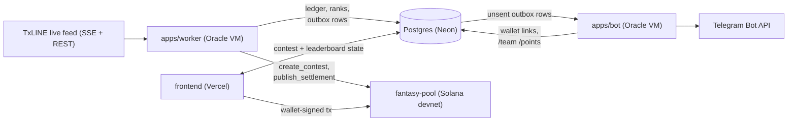

# Daze — Technical Documentation

Mobile-first Solana fantasy football for TxLINE-covered World Cup fixtures.

:::warning
**Pre-release build.** Devnet only, valueless test tokens, single-operator settlement key. See [Trust model & security](#trust-model--security) and [Release status](#release-status) before treating any contest as live or as a template for a real-value deployment.
:::

## Overview

Daze turns every verified on-pitch action from a TxLINE-covered World Cup fixture into an immediate, explainable fantasy-football consequence: a player's points change, a team total updates, a rank shifts, and — if the user opted in — a Telegram DM explains exactly why.

The **web app owns the entire product surface**: Solana wallet sign-in, contest entry, XI selection, captaincy, team lock, live scoring, leaderboard, reconciliation, settlement, and prize claims. A **Telegram bot** is an optional retention companion — reminders and personal point/rank/correction/final-result DMs — and never touches wallets, stakes, or team edits.

**Winning thesis:** every verified TxLINE action should answer four questions for the fan within one card or DM — *what happened on the pitch, which of my players did it affect, why did my points change by this amount, and how did my total/rank move?*

## System architecture

Daze is split into independently deployable services that never talk to each other directly. They coordinate only through committed state in Postgres and on-chain accounts — nothing else is a source of truth.



| Service | Runtime | Responsibility |
| --- | --- | --- |
| `frontend/` | Next.js on Vercel | Wallet auth, team builder, live scoring UI, leaderboard, claim flow |
| `apps/api` | Shared library, imported by `frontend/` | Wallet sessions, draft commands, locks, entry construction, Telegram linking |
| `apps/worker` | Node/tsx, Docker container | TxLINE ingestion, normalization, scoring projection, recovery, replay, contest lifecycle, settlement orchestration |
| `apps/bot` | Node/tsx, Docker container | Interactive Telegram commands (`/link`, `/team`, `/points`, `/settings`, ...) and outbound DM delivery from committed ledger rows only |
| `programs/fantasy-pool` | Anchor / Rust | On-chain contest vault, entry, Merkle settlement, claim, cancel/refund |

`apps/worker` and `apps/bot` run as two independently deployed Docker containers on the same VM, each with its own env file and lifecycle — a restart of one never affects the other. Postgres (Neon) is the only thing connecting the frontend, worker, and bot; there is no direct network path between the three services.

## Real-time scoring pipeline

The worker holds a persistent SSE connection to TxLINE and turns every match action into a scored, notified, replay-safe fact within seconds.

```text
TxLINE SSE message
  -> validate + content-hash + persist the raw payload         (no raw payload, no score)
  -> normalize into a versioned domain event                    (packages/txline-client)
  -> project into an append-only scoring ledger                 (packages/scoring)
  -> recompute entry totals + ranks
  -> write a notification_outbox row (same step, no Telegram call yet)
  -> apps/bot drains the outbox every 5s -> Telegram Bot API
```

**Ingestion order is strict and append-only.** Nothing is scored from a raw payload that wasn't durably persisted first, and nothing is normalized from an event that wasn't content-hash-deduplicated first. Corrections don't mutate history: TxLINE's `action_amend`/`action_discarded` events cause the projector to *reverse* the prior ledger row (a new row with negated points and a `reversalOf` back-reference) and, if applicable, append a fresh corrected row — the ledger is always fully replayable from immutable raw payloads alone.

### Capability gate

Every provider payload semantic (a position ID, a player-join field, an action shape) starts `SHADOW` or `DISABLED` and can only be promoted to `VERIFIED` after being proven against a captured, real TxLINE payload with regression test coverage (`packages/config/src/capabilities.ts`). Unknown or unverified inputs fail closed — they are quarantined, never guessed.

| Capability | State | Notes |
| --- | --- | --- |
| Player roster / position / starter status | `VERIFIED` | Position mapping `txline-soccer-world-cup-v1`: `34→GK 35→DEF 36→MID 37→FWD` |
| Substitution | `VERIFIED` | Resolves `PlayerInId`/`PlayerOutId` via `player.normativeId` |
| Goal (open play) | `VERIFIED` | `GoalType = Shot \| Head` |
| Penalty goal | `VERIFIED` | Regulation `penalty_outcome`, `Outcome=Scored`; shootouts (`StatusId=12`) explicitly excluded |
| Own goal | `VERIFIED` | `action_amend` goal replacement, `GoalType=Own` |
| Yellow card | `VERIFIED` | Including duplicate-update and `action_discarded` reversal coverage |
| Red card (straight) | `VERIFIED` | `Data.Type=StraightRed` |
| Second yellow | `VERIFIED` | Paired yellow + adjustment totals −3 |
| Match clock / final score | `VERIFIED` | `game_finalised` exposes final goals in `Stats` keys 1/2 |
| Penalty miss | `DISABLED` | Awaiting a verified outcome enum |

Player/action joins never assume `dataSoccer.PlayerId == fixturePlayerId` — every score action is joined to a lineup player through the confirmed lineup's `player.normativeId`, and an unresolved join returns no normalized event rather than mis-scoring (see [ADR 0003](https://github.com/SachPlayZ/daze/blob/main/docs/decisions/0003-player-action-id-join.md)).

### Scoring rules (v1.0.0)

Fixed constants in `packages/scoring/src/index.ts` — not configurable per contest:

| Action | GK | DEF | MID | FWD |
| --- | --- | --- | --- | --- |
| Starting / sub appearance | +1 | +1 | +1 | +1 |
| Appearance ≥ 60 min | +1 | +1 | +1 | +1 |
| Goal / penalty goal | +6 | +6 | +5 | +4 |
| Own goal | −2 | −2 | −2 | −2 |
| Penalty miss | −2 | −2 | −2 | −2 |
| Yellow card | −1 | −1 | −1 | −1 |
| Second-yellow adjustment | −2 | −2 | −2 | −2 |
| Direct red card | −3 | −3 | −3 | −3 |
| Clean sheet | +4 | +4 | +1 | 0 |
| Goals conceded (per 2) | −1 | −1 | 0 | 0 |

Captain doubles every ledger row for that entry, positive or negative, applied once at row-creation time to `basePoints → appliedPoints`; because reversal rows are generated by negating an already-multiplied value, the multiplier survives reversal automatically without double-applying. Vice-captain fallback is a **final-replay-only** decision: if the captain's rebuilt participation interval is exactly zero at full replay, the vice-captain's already-recorded rows are re-emitted once more; one second of captain participation permanently disables the fallback.

### Tie-breaking

Deterministic, published, and never based on stake or wallet: (1) highest finalized points, (2) highest non-captain base points, (3) most selected-player goals, (4) earliest team-lock timestamp, (5) stable ascending entry hash. Live leaderboard rank uses only criterion (1) plus a stable ID sort and is always labelled provisional; the full criteria apply at final reconciliation.

## Data model

PostgreSQL (Neon), migrated via plain, idempotent SQL files in `packages/db/migrations`. No ORM — every service (`frontend`, `apps/worker`, `apps/bot`) talks to the same schema through `pg`.

| Table | Purpose |
| --- | --- |
| `fixtures` | Per-fixture lifecycle, kickoff time, feed/readiness state |
| `raw_provider_events` | Immutable, content-hash-deduplicated raw TxLINE payloads |
| `normalized_events` | Versioned domain events derived from raw payloads |
| `fantasy_ledger` | Append-only point deltas per entry; source of truth for totals |
| `locked_teams` | Immutable XI per `(contest_id, wallet)` once locked |
| `entry_totals` | Denormalized running total + rank per entry, recomputed on each ledger write |
| `contests` | Per-fixture/stake-tier contest state (`PENDING_CREATION \| CREATED \| LOCKED \| SETTLED`) — replaces any hardcoded/env-var contest identity |
| `contest_settlements` | Published Merkle root + tx signature per settled contest |
| `notification_outbox` | Outbox pattern for Telegram delivery — see [Notification system](#notification-system) |
| `notification_preferences` | Per-wallet opt-in toggles |
| `telegram_links` / `telegram_link_tokens` | Wallet ↔ Telegram account linking |
| `wallet_challenges` | Sign-in-with-Solana challenge/response state |
| `provider_cursors` | Worker's SSE resume position per stream |
| `fixture_odds_snapshots` | Periodic TxLINE odds captures for the display-only Market Pulse feature |
| `historical_replay_sessions` | State for the demo/judge-mode historical replay theatre |

## On-chain program (`programs/fantasy-pool`)

An Anchor program is the **only custodian of staked funds** — no operator wallet ever directly holds or moves user stakes.

### Accounts (all PDAs)

```text
ContestPda    = ["contest", sha256(fixture_id), stake_tier_u64_le]
VaultPda      = associated-token-account(mint, ContestPda, allowOwnerOffCurve=true)  — Token-2022 only
EntryPda      = ["entry", ContestPda, wallet]
SettlementPda = ["settlement", ContestPda]
```

| Account | Size (bytes, incl. 8-byte discriminator) | Key fields |
| --- | --- | --- |
| `Contest` | 187 | `authority, fixture_id_hash, stake_tier, mint, stake_amount, lock_ts, vault, settlement_root, finalized, cancelled, bump` |
| `Entry` | 99 | `contest, wallet, team_hash, claimed, refunded, bump` |
| `Settlement` | 89 | `contest, payout_total, claimed_total, root, published_at, bump` |

Account sizes are asserted by a Rust unit test (`account_space_matches_serialized_fields`) and cross-checked off-chain by preflight scripts before any contest is created — a mis-sized account discovered after real contests exist is expensive to fix.

### Instructions

| Instruction | Effect | Key guards |
| --- | --- | --- |
| `create_contest` | Opens a contest vault for a fixture + stake tier | `stake_amount > 0`; `lock_ts` in the future; Token-2022 only |
| `enter_contest` | Transfers exactly `stake_amount` into the vault, records a committed team-hash | Not locked/cancelled/finalized; mint + vault match the contest |
| `publish_settlement` | Posts a Merkle root + payout total | Caller is `contest.authority`; only after `lock_ts`; `payout_total ≤` vault balance |
| `claim_prize` | Pays a winner against a Merkle proof | Contest finalized, not cancelled; entry not already claimed/refunded; proof verifies against the published root; program-signed CPI transfer |
| `cancel_contest` | Marks a contest cancelled (e.g. below minimum entrants) | Caller is `contest.authority`; not already finalized/cancelled |
| `claim_refund` | Returns a cancelled contest's stake | Contest cancelled, not finalized; entry not already claimed/refunded |

Token-2022 is enforced with an explicit runtime key check on every account touching the vault or a wallet's token account — not only Anchor's declarative constraint, which a devnet negative-simulation test proved would still accept a legacy SPL Token pairing on its own.

## Contest lifecycle automation

A worker-side poller removes every manual operator step from running a contest:

- **`autoCreateContests()`** opens a devnet contest for every fixture within a 7-day window that doesn't have one yet, computing `lock_ts = kickoff_at − 30 minutes`, and simulates each transaction before sending and verifies on-chain state after.
- **`checkAndSettleContests()`** watches for TxLINE's `game_finalised` action, confirms the ledger has zero unresolved scoring actions, computes the payout curve, and publishes the settlement Merkle root — then notifies every entrant of their final rank/points/payout.
- **Payout curve**: 1 entrant → 100%; 2 → 70/30; 3+ → top-3 split 50/30/20 of the vault.
- **Kill switch**: every exported function in `contest-lifecycle.ts` is a true no-op unless `FANTASY_AUTO_LIFECYCLE_ENABLED=true`.

This automation is explicitly scoped to the devnet deployment (see [ADR 0013](https://github.com/SachPlayZ/daze/blob/main/docs/decisions/0013-automated-contest-lifecycle.md)) — it reuses, rather than lowers, the single-operator-key trust model described below.

## Notification system

Telegram delivery follows a strict outbox pattern so a DM is never sent for points that didn't actually commit, and never duplicated across retries or worker restarts.

- **Outbox, not direct send**: the worker's scoring step writes a `notification_outbox` row in the same logical step as the ledger write; a separate 5-second poll loop drains unsent rows and calls the Telegram API. Only the worker ever writes `sent_at` — the bot process never drains the outbox itself, ruling out a two-writer race.
- **Idempotency key**: derived from `(wallet, sourceEventKey, ruleCode, sourceRevision)` (or the equivalent stable key for rank/correction/final notifications) — a duplicate SSE delivery or worker restart re-derives the identical key and the insert is a no-op.
- **Five independent opt-in toggles** (`notification_preferences`), each backed by its own producer:

  | Toggle | Fires on |
  | --- | --- |
  | `point_impacts` | Every fresh (non-correction) ledger row for a linked, unpaused wallet |
  | `rank_changes` | The entry's rank changes, independent of `point_impacts` |
  | `reconciliation` | An amendment reverses a prior ledger row (grouped so a reversal + replacement sends one message, not two) |
  | `final_results` | A contest settles — sent to every entrant, not only the paid top 3 |
  | `paused` (`/stop`) | Global mute, overrides all of the above |

## Frontend

Next.js App Router, wallet-native (no separate account system). Core user journey:

```text
Connect Solana wallet
  -> see today's TxLINE-covered fixtures
  -> open the official contest for one fixture
  -> Manual Build or Quick Pick (deterministic, seeded auto-pick)
  -> pick a supported formation, select 11 eligible players, choose captain/vice-captain
  -> lock team (immutable) and sign the devnet entry transaction
  -> follow live points, rank, and TxLINE event impacts
  -> receive Telegram DMs if linked and opted in
  -> see final reconciliation and claim a prize if eligible
```

Formation/position caps (e.g. exactly 5 DEF in a 5-3-2) are enforced client-side against the same `formationCounts` map the server-side validator uses, so a user can never build a squad the server will later reject. Player selection is sourced only from live TxLINE lineup data — there is no hardcoded or scraped roster fallback.

## Trust model & security

- **Verification-gated scoring.** See [Capability gate](#capability-gate) — nothing scores from an unverified payload shape.
- **Settlement is auditable, not (yet) trustless.** An operator-controlled key publishes a Merkle root of off-chain-computed final standings; the chain does not independently recompute fantasy points. This is made auditable rather than hidden: the scoring version, every raw provider event's content hash, the full ledger export, and each entry's on-chain team-hash commitment are all inspectable, so anyone can independently replay the same raw events and verify the published root matches. See [ADR 0008](https://github.com/SachPlayZ/daze/blob/main/docs/decisions/0008-settlement-trust-model.md).
- **Nothing is sent or settled from inside a DB transaction.** Telegram DMs and Solana transactions are always built from state that already committed.
- **One entry per wallet per fixture/stake tier**, fixed stake, immutable team after lock, enforced independently by both the API (server clock) and the on-chain program (`lock_ts` check in `enter_contest`) so a client bypassing the API still cannot enter late.
- **Devnet-only, valueless test token.** No code path in this repository accepts a real-value asset.

:::danger
The automated contest lifecycle, the 30-minute lock buffer, and the single-authority settlement key are all explicitly scoped to this devnet deployment. None of them are valid reasoning for a mainnet or otherwise real-value deployment without a new ADR covering multi-signer settlement, on-chain proof verification, and legal/audit review.
:::

## Deployment topology

- **Frontend** — Next.js on Vercel, auto-deployed from `main`.
- **Worker + bot** — two Docker containers on a single Oracle Cloud VM, each deployed independently by its own GitHub Actions workflow (SSH + `docker build`/`docker run`) on push to `main`, gated by path filters so an unrelated change doesn't trigger a redeploy of the other.
- **Postgres** — a single Neon instance, the only integration point between the three services.
- **Solana devnet** — every service that builds a transaction against `fantasy-pool` does so client-side, against the same account layout (`packages/solana-client`).

## Testing

Per-boundary `node:assert`-based specs (`tests/**/*.spec.ts`, run via `scripts/run-tests.mjs`, no test framework dependency) plus captured real TxLINE provider fixtures (`tests/provider-fixtures/txline-devnet/`) — normalizer, scoring, ranking, and replay logic are tested against actual payload shapes, never synthetic approximations. Coverage spans: TxLINE contract/normalizer tests, scoring/projector tests, ranking/tie-break tests, Solana instruction-building and settlement tests, worker ingestion tests, API auth/commands tests, and Telegram message-builder tests.

## Tech stack

| Layer | Choice |
| --- | --- |
| Frontend | Next.js (App Router), React, TypeScript |
| Backend services | Node.js + `tsx` (no build step, TypeScript run directly), `pg` |
| Database | PostgreSQL (Neon), plain SQL migrations, no ORM |
| Blockchain | Solana devnet, Anchor 0.30.1, Token-2022 |
| Messaging | Telegram Bot API (long-polling bot process + outbox-drained DM sender) |
| Data provider | TxLINE (TxOdds) — SSE live feed + REST snapshots |
| Infra | Vercel (frontend), Oracle Cloud VM + Docker (worker/bot), GitHub Actions (CI/CD) |

## Release status

Historical Replay and Judge Mode are backed by a captured real TxLINE World Cup sequence, verified position mapping, deterministic projection, and an executable devnet `fantasy-pool` program — intentionally with no fixture/player fallback. Daze cannot be described as fully live until the entire judged path is proven end-to-end against a real, live fixture: verified lineups → valid XI → devnet entry → verified action → ledger → reconciliation → settlement → claim. Two specific items are flagged as unverified against real live (non-replay) multi-fixture traffic: whether TxLINE's SSE stream broadcasts all subscribed fixtures on one connection, and whether a live fixture's lineup is ever re-broadcast into the persisted event stream (both fail closed — no incorrect payout, just no automatic settlement — if unconfirmed).

## Architecture decision records

Full records live in [`docs/decisions/`](https://github.com/SachPlayZ/daze/blob/main/docs/decisions/); one-line summary of each:

| ADR | Decision |
| --- | --- |
| [0001](https://github.com/SachPlayZ/daze/blob/main/docs/decisions/0001-provider-capability-gate.md) | Capability-gated provider scoring — fail closed until proven |
| [0002](https://github.com/SachPlayZ/daze/blob/main/docs/decisions/0002-txline-soccer-position-mapping.md) | Confirmed position-ID mapping, versioned |
| [0003](https://github.com/SachPlayZ/daze/blob/main/docs/decisions/0003-player-action-id-join.md) | Player/action join key is `normativeId`, never `fixturePlayerId` |
| [0004](https://github.com/SachPlayZ/daze/blob/main/docs/decisions/0004-scoring-captain-semantics.md) | Fixed scoring table; captain multiplier applied once, survives reversal |
| [0005](https://github.com/SachPlayZ/daze/blob/main/docs/decisions/0005-lock-time-policy.md) | Dual-enforced lock (server + on-chain), operator-supplied `lock_ts` |
| [0006](https://github.com/SachPlayZ/daze/blob/main/docs/decisions/0006-tie-breaking.md) | Deterministic 5-criterion tie-break, never stake/wallet |
| [0007](https://github.com/SachPlayZ/daze/blob/main/docs/decisions/0007-contest-economics.md) | Fixed stake, devnet test token, 50/30/20 payout preset |
| [0008](https://github.com/SachPlayZ/daze/blob/main/docs/decisions/0008-settlement-trust-model.md) | Auditable single-key settlement, not (yet) trustless |
| [0009](https://github.com/SachPlayZ/daze/blob/main/docs/decisions/0009-telegram-notification-policy.md) | Outbox pattern, idempotent, opt-in Telegram delivery |
| [0010](https://github.com/SachPlayZ/daze/blob/main/docs/decisions/0010-solana-program-account-layout.md) | Fixed, unit-tested PDA account layout |
| [0011](https://github.com/SachPlayZ/daze/blob/main/docs/decisions/0011-market-pulse-odds-display.md) | Odds are display-only, never affect scoring, never fabricated |
| [0012](https://github.com/SachPlayZ/daze/blob/main/docs/decisions/0012-lock-time-policy-amendment.md) | Automated 30-minute lock buffer (devnet-only justification) |
| [0013](https://github.com/SachPlayZ/daze/blob/main/docs/decisions/0013-automated-contest-lifecycle.md) | Fully automated contest creation + settlement (devnet-only) |

Further reading: [`PLAN.md`](https://github.com/SachPlayZ/daze/blob/main/PLAN.md) (full product plan), [`docs/txline/provider-notes.md`](https://github.com/SachPlayZ/daze/blob/main/docs/txline/provider-notes.md) (confirmed payload contracts), [`docs/operations/release-gate.md`](https://github.com/SachPlayZ/daze/blob/main/docs/operations/release-gate.md) (what's left before going live).
